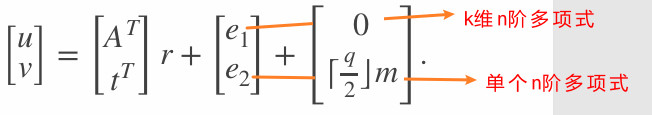

<details open markdown="block">
  <summary>
    Table of contents
  </summary>
  {: .text-delta }
1. TOC
{:toc}
</details>


## NIST 标准
- [FIPS203中文版]


## KEM 介绍
- [什么是KEM 和 IND-CCA2安全性]

## ML-KEM 原理
### 域参数 和 密钥生成
对于ML-KEM-768:
```bash
q = 3329
n = 256
k = 3
η1 = 2
η2 = 2
```
密钥生成：
- 公钥 (A,t), 其中  $$A \in R_q^{k×k} $$, $$s \in S_{η1}^k $$,$$e \in S_{η2}^k $$ , $$t = As + e $$,用于加密. 
    - A是均匀随机生成的kxk矩阵，
    - s是k维的小多项式向量，系数大小最多为η1; 
    - e是k维的小多项式向量，系数大小最多为η2;

- 私钥 $$s \in S_{η1}^k $$ ,用于解密

## 加密
加密 一个$$ m\in\{0,1\}^n $$
1. Bob 获取 公钥 (A,t)
2. 选择 $$ r \in _RS^k_{η_{1'}} , e_1 \in _RS^k_{η_{2'}} 且\ e_2 \in _RS^k_{η_{2'}}  $$.  η1'为η1 ，η2' 为η2
3. 计算密文(u,v)  
$$ u  = A^Tr + e_1 , \\  v  = t^Tr + e_2 + \lceil q/2 \rceil m$$

## 解密
Alice可以使用私钥s解密
$$
m = Round_q(v - s^Tu) \\ =Round_q(t^Tr + e_2 + \lceil q/2 \rceil m - s^Tu) \\ =Round_q(t^Tr + e_2 + \lceil q/2 \rceil m - (s^TA^Tr+s^Te_1)) \\ =Round_q((As+e)^Tr + e_2 + \lceil q/2 \rceil m - (s^TA^Tr+s^Te_1)) \\ =Round_q(s^TA^Tr + e^Tr + e_2+ \lceil q/2 \rceil m - (s^TA^Tr+s^Te_1))\\ =Round_q(\lceil q/2 \rceil m+ e^Tr + e_2 - s^Te_1) $$

其中 $$size(e^Tr) =  nη_2η_{1'} = 256*2*2 =  1024 $$,

其中 $$size(s^Te_1) = nη_1η_{2'} = 256*2*2 =  1024 $$

##  Toy example - Kyber PKE (参数设置小只是为了方便展示)
 Domain parameters: 

✦ Key generation: Alice selects:  
$$q =137\\ n=4\\ k=2\\ η_1=2\\ η_2=2$$

$$A = \begin{bmatrix}
21 + 57x + 78x^{2}+43x^{3}&126 + 122x + 19x^{2}+125x^{3}\\
111 + 9x + 63x^{2}+33x^{3}&105 + 61x + 71x^{2}+64x^{3}
\end{bmatrix} $$
$$
s = \begin{bmatrix}
1 + 2x - x^{2}+2x^{3} \\
 -x + 2x^{3}
\end{bmatrix}, \quad \\
e = \begin{bmatrix}
1 - x^{2}+x^{3} \\
 -x + x^{2}
\end{bmatrix}
$$
并且计算
$$\\
t = As + e = \begin{bmatrix}
55 + 96x + 123x^{2}+ 7x^{3}\\
32 + 27x + 127x^{2}+ 100x^{3}
\end{bmatrix}
$$
 


Alice的公钥(A,t)用于加密，私钥s用于解密


### toy example: 加密
Bob进行加密：
首先，消息编码为 多项式:
$$ 
m=0111 ↔ x+x^2+x^3
$$
，接着Bob选择 $$r, e_1, e_2$$

其中
$$
r = \begin{bmatrix}-2 + 2x + x^{2}-x^{3}\\-1 + x + x^{2}\end{bmatrix}, \quad e_1 = \begin{bmatrix}1 - 2x^{2}+x^{3}\\-1 + 2x - 2x^{2}+x^{3}\end{bmatrix}, \quad  e_2 = 2 + 2x - x^{2}+x^{3}
$$

然后计算：
$$
u = A^Tr + e_1=\begin{bmatrix}56 + 32x+77x^2 + 9x^3\\45 + 21x+2x^2+127x^3\end{bmatrix} \\ \\
v = t^Tr + e_2+ 69m = 3 + 10x + 8x^2 + 123x^3
$$
密文 c  = (u,v)

  


### toy example: 解密
Alice使用她的解密密钥s，计算 $$v - s^Tu = 4 + 60x + 79x^2 + 66x^3$$
且，round之后,q/4 = 137/4=34.25，即 [-34,34] 的系数设置为0，其余[35,68]∪[-68,-35] 为1:
得到round之后的多项式 $$0 + 1x^1 + 1x^2 + 1x^3$$
于是 恢复了原消息：0111
```txt
Rounded value  ◄─────────────┐                         ┌────────────►  
                             └─────────────────────────┘               
                                                                       
 Modsq value   ──────────────┬────────────┬────────────┬─────────────  
              -q/2         -q/4           0           +q/4          q/2
                                                                       
 Raw   value   ──────────────────────────────────────────────────────  
               0                                                    q  
```

## 安全性
声称：假设 D-MLWE 问题难以解决，简化的 Kyber-PKE 方案在选择明文攻击(chosen-plaintext attack)下具有不可区分性。

论据：
加密操作：
$$
\begin{bmatrix} u \\ v \end{bmatrix} = \begin{bmatrix} A^T \\ t^T \end{bmatrix} r + \begin{bmatrix} e_1 \\ e_2 \end{bmatrix} + \begin{bmatrix} 0 \\ \left\lceil \frac{q}{2} \right\rfloor \end{bmatrix} m $$

根据 D-MLWE 假设，$$\begin{bmatrix} A^T \\ t^T \end{bmatrix}$$ 与随机数无法区分。
  
同样根据D-MLWE 假设，
$$
\begin{bmatrix} A^T \\ t^T \end{bmatrix}r + \begin{bmatrix}
e_1 \\ e_2 \end{bmatrix}= \begin{bmatrix} A^Tr + e_1 \\
t^Tr + e_2 \end{bmatrix}
$$
与随机数无法区分。

因此，从对手的角度来看，$$v$$ 似乎是 $$R_q$$ 中随机元素 $$(\boldsymbol{t}^T\boldsymbol{r} + e_2)$$ 与消息多项式 $$\left\lceil\frac{q}{2}\right\rceil m$$ ，所以对手无法得知关于 \(m\) 的任何信息。


## 解密并不总是有效
问题：解密是否有效？即，
$$m = \mathrm{Round}_q (v - s^T u)$$是否成立?


首先之前讨论过
$$
(v - s^Tu) \\  =(\lceil q/2 \rceil m+ e^Tr + e_2 - s^Te_1) $$

那么我们让 $$u' = u + e_u, \\ v' = v + e_v$$
则 $$(v' - s^Tu') \\  =\lceil q/2 \rceil m+ e^Tr + e_2 - s^Te_1 + e_v - s^T e_u $$

因此，如果误差多项式$$E(x)=e^Tr + e_2 - s^Te_1+ e_v - s^T e_u $$的每个系数$E_i$满足
$$-q/4 < E_i \bmod q < q/4$$，即$$\|E\|_{\infty}<q/4$$，则$$\text{Round}_q(v - s^Tu)=m$$。

现在，$$\|E_i\|_{\infty}\leq kn\eta_1\eta_2+\eta_2+kn\eta_1\eta_2$$。

对于ML - KEM - 768参数($$q = 3329, n = 256, k = 3, \eta_1=\eta_2 = 2$$)，我们有
$\|E_i\|_{\infty}\leq6146 \nless q/4$。因此，不能保证解密成功。

然而，**可以证明**以接近1的概率$\|E\|_{\infty}<q/4$。因此，解密几乎肯定会成功。 

# V2b：优化
## 密钥的字节大小以及密文的字节大小
为了具体起见，我们将考虑ML-KEM-768
parameters($$q = 3329, n = 256, k = 3, \eta_1 = 2, \eta_2 = 2$$)。
在$$\mathbb{Z}_q$$中，整数的位长度是$$\lceil \log_2 3329 \rceil = 12$$位。

加密密钥：加密密钥$$(A, t)$$的字节大小是
$$(3^2 \times 256 \times 12)+(3 \times 256 \times 12) = 36864\text{位}$$，即4608字节。

密文：密文$c = (u, v)$的字节大小是
$$(3 \times 256 \times 12)+(256 \times 12) = 12288 \text{位}$$，即1536字节。
### 更小的密钥
想法：从随机（且公开）的256位种子$$\rho$$生成A。

通过首先选择$$\rho \in_R \{0, 1\}^{256}$$，然后通过对计数器哈希$$\rho$$来生成多项式的系数，从而生成A中的多项式。

加密密钥是$$(\rho, t)$$而不是$$(A, t)$$。

任何知道$$\rho$$的人都可以生成A。

现在加密密钥的大小是$$256 + (3 \times 256 \times 12)$$位，即1184字节（相比4608字节大幅减少）。 

## Compress
想法: 丢弃密文$$c = (u, v)$$中所有多项式系数的“低阶”位。

设$$1 \leq d \leq \lfloor \log_2 q \rfloor$$，并定义:
对于$$x \in [0, q - 1]$$，$$Compress_q(x, d)=\lceil (2^d/q) \cdot x \rceil \bmod 2^d$$。
对于$$y \in [0, 2^d - 1]$$，$$Decompress_q(y, d)=\lceil (q/2^d) \cdot y \rceil \bmod q$$。

事实: 设$x \in [0, q - 1]$且$x' = \text{Decompress}_q(\text{Compress}_q(x, d), d)$。
那么$\|x' - x\|_{\infty} \leq \lfloor q/2^{d + 1} \rfloor$。

函数“压缩”和“解压缩”自然地扩展到$R_q$中的多项式以及$R_q^k$中的多项式向量。 

## 中心二项式分布
## 快速多项式乘法
 
## ML-KEM 计算工具
### openssl 3.5.0 对于 ML-KEM 的应用
ML-KEM密钥对生成
```bash
openssl genpkey -algorithm ML-KEM-512 -out ML-KEM-512_priv.pem
```

ML-KEM密钥对打印
```bash
openssl pkey -in ML-KEM-512_priv.pem -noout -text
```

ML-KEM公钥导出
```bash
openssl pkey -in ML-KEM-512_priv.pem -pubout -out ML-KEM-512_pub.pem
```

公钥打印
```bash
openssl pkey -pubin -in ML-KEM-512_pub.pem -noout -text
```

### ML-KEM 密钥封装

### ML-KEM 解封装


[FIPS203中文版]:./FIPS203_CN

[什么是KEM 和 IND-CCA2安全性]:./article--KEMs_and_Post-Quantum_age.md


[<< 回到首页](./index)