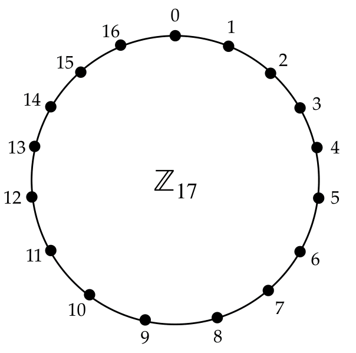

Vlb: Mathematical prerequisites 
1. Modular arithmetic 
2. The polynomial ring $$R_q=Z_q[x]/(x^n+1)$$
3. The module R 
4. "Small" polynomials 
5. Lattice problems: MLWE, D-MLWE and MSIS 
6. Why lattices? 

---

Vlb：数学先决条件 
1. 模运算 
2. 多项式环 $$R_q=Z_q[x]/(x^n+1)$$
3. 模 R 
4. “小”多项式 
5. 格问题：MLWE、D-MLWE 和 MSIS 
6. 为什么是格子？

---

- Modulus: q > 2   
- a=b (mod q ) means that a–b is an integer multiple of q.   
- r=a mod q means that r is the remainder upon dividing the integer a by q (so 0 ≤ r ≤ q-1).    
- Integers modulo q: $$Z_q = {0,1,2,..., q - 1}$$, where addition, subtraction and multiplication are performed modulo q.    
- Example: $$ Z_{17} = {0,1,2,3,4,5,6,7,8,9,10,1 1,12, 13, 14, 15, 16}$$. 
    - In $$ Z_{17}$$, 9+ 15 =7, 9-15 = 11, and 9x 15 = 16. 
    - More precisely, 9 + 15 = 24 =7 (mod 17), 9-15 = -6 =11 (mod 17), and 9 x 15 = 135 = 16 (mod 17). 

---

[<< 回到首页](./index)